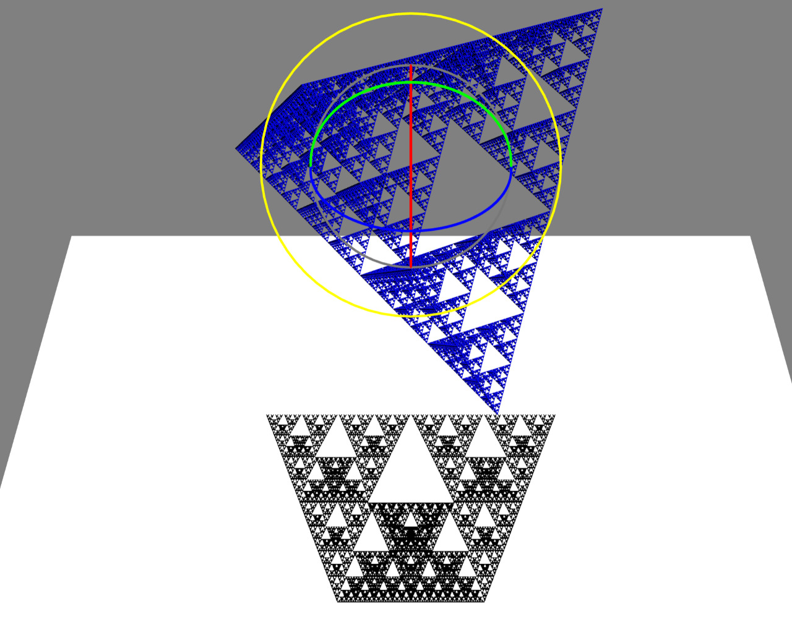

# Sierpinski Fractal Shadow 3D Animation

A three.js proof-of-concept application rendering the Sierpinski tetrahedron fractal and its shadow cast by a directional light source.

- Inspired by Prof Hideki Tsuiki's paper [Projected images of the Sierpinski tetrahedron and other fractal imaginary cubes](https://arxiv.org/abs/2205.13065).

- Some aspects of the code have been derived from code in [Discover three.js](https://discoverthreejs.com/book/).

